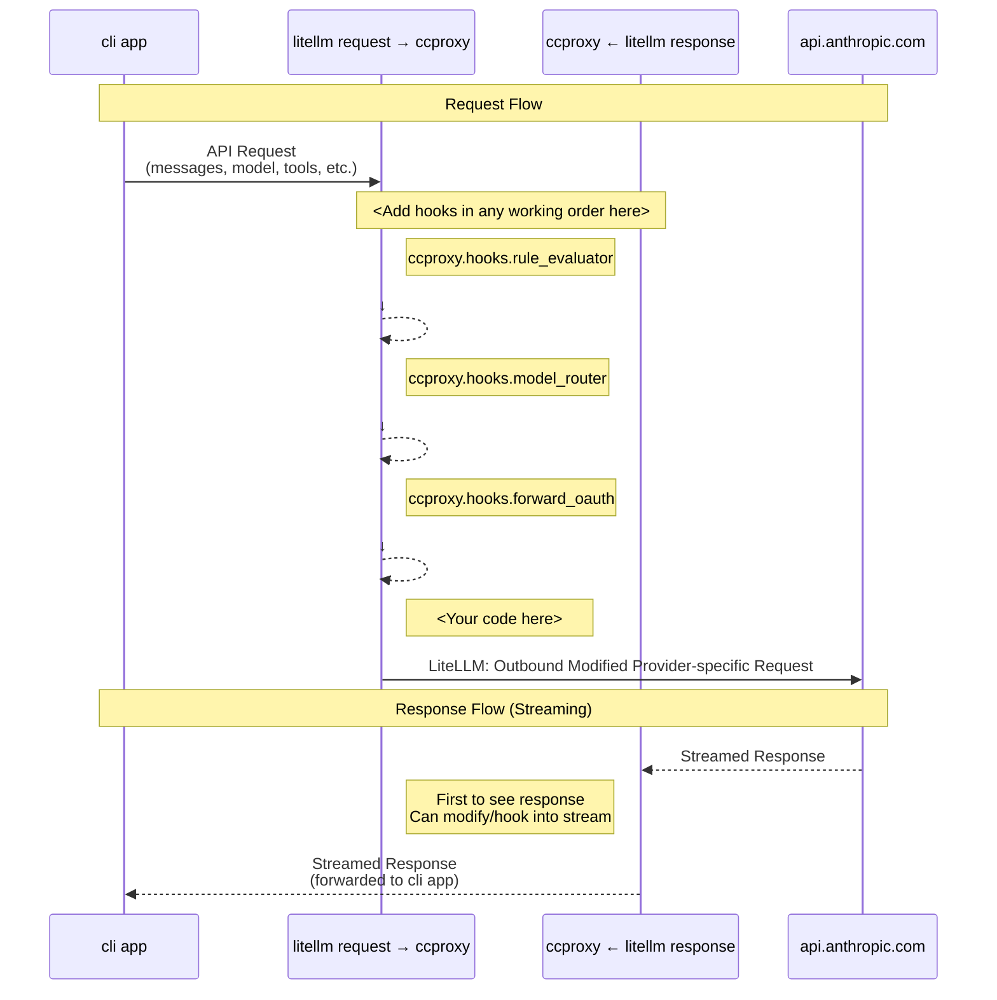

# API Request Flow

```mermaid
sequenceDiagram
    participant CC as cli app
    participant CP as litellm request → ccproxy
    participant LP as ccproxy ← litellm response
    participant API as api.anthropic.com

    Note over CC,API: Request Flow
    CC->>CP: API Request<br/>(messages, model, tools, etc.)
    Note over CP,LP: <Add hooks in any working order here>

    Note right of CP: ccproxy.hooks.rule_evaluator
    CP-->>CP: ↓
    Note right of CP: ccproxy.hooks.model_router
    CP-->>CP: ↓
    Note right of CP: ccproxy.hooks.forward_oauth
    CP-->>CP: ↓
    Note right of CP: <Your code here>
    CP->>API: LiteLLM: Outbound Modified Provider-specific Request

    Note over CC,API: Response Flow (Streaming)
    API-->>LP: Streamed Response
    Note right of CP: First to see response<br/>Can modify/hook into stream
    LP-->>CC: Streamed Response<br/>(forwarded to cli app)
```
